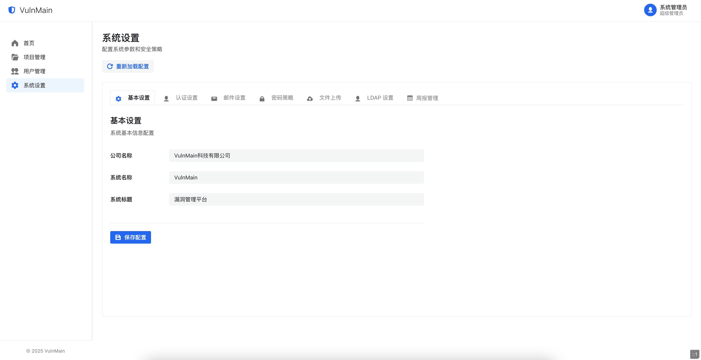

# VulnMain 漏洞管理系统

<div align="center">


</div>

> 🛡️ 一站式企业级漏洞管理与资产追踪平台，助力安全团队高效发现、跟踪与修复安全漏洞

## ✨ 项目简介

VulnMain 是一个基于现代化技术栈开发的企业级漏洞管理系统，采用 **Go (Gin) + Next.js** 架构，为安全团队和开发团队提供完整的漏洞生命周期管理解决方案。

注：本项目处于持续开发迭代期，会不定期进行项目功能更新与优化，不建议部署在生产环境使用，我们将尽快发布稳定版本以便您进行部署使用。

### 🎯 核心价值

- **全流程管理**：从漏洞发现到修复验证的完整闭环
- **团队协作**：支持多角色权限管理，促进安全与开发团队协作
- **数据驱动**：丰富的统计分析功能，助力安全决策
- **现代化界面**：基于 Semi UI 的响应式设计，提供优秀的用户体验

## 👥 权限管理体系

### 角色定义

| 角色 | 权限范围 | 主要职责 |
|------|----------|----------|
| 🔑 **超级管理员** | 全系统权限 | 系统配置、用户管理、项目管理 |
| 🛡️ **安全工程师** | 漏洞全流程管理 | 漏洞录入、分派、复测、验证 |
| 👨‍💻 **研发工程师** | 漏洞修复权限 | 漏洞修复、状态更新 |

### 权限细节

- **超级管理员**：可操作所有功能，添加项目、用户、修改系统配置等操作
- **安全工程师**：可操作项目资产录入、项目漏洞录入、漏洞分派、漏洞复测、漏洞验证全流程
- **研发工程师**：可操作漏洞修复、漏洞验证全流程
- **项目成员**：仅项目下的成员有权限查看项目详情、添加漏洞和添加资产

## 🚀 快速开始

### 环境要求

- **Go**: 1.22+
- **Node.js**: 16.0+
- **MySQL**: 5.7+ 或 8.0+
- **npm/yarn**: 最新版本

### 1. 📥 克隆项目

```bash
git clone https://github.com/VulnMain/VulnMainProject.git
cd VulnMainProject
```

### 2. ⚡ 推荐部署（Docker Compose，一条命令启动）

> 新增：已支持 `docker-compose.yml`，默认会启动 `mysql + backend + frontend`，无需手工改前端源码地址。

```bash
# 复制环境变量模板
cp .env.example .env

# 启动所有服务
docker compose up -d --build

# 查看状态
docker compose ps
```

> Windows 常见报错排查：
> - `the attribute version is obsolete`：Compose V2 已废弃 `version` 字段，可忽略；本仓库已移除该字段。
> - `open //./pipe/dockerDesktopLinuxEngine: The system cannot find the file specified`：这是 **Docker Desktop 引擎未启动**，不是项目配置错误。请先启动 Docker Desktop，并确认状态为 Running，再执行 `docker compose up -d --build`。
> - 若仍失败，可在 PowerShell 执行：
>   `docker version`（确认 Client/Server 都有输出）
>   `docker context ls`（确认当前 context 可用，通常是 `desktop-linux`）
>   `docker compose ls`（确认 compose 子命令可正常连接引擎）

默认访问地址：

- 前端：`http://127.0.0.1:3000`
- 后端 API：`http://127.0.0.1:5000`
- MySQL：`127.0.0.1:3306`

停止服务：

```bash
docker compose down
```

### 3. 🗄️ 本地手工部署（可选）

#### 创建数据库
```sql
CREATE DATABASE vulnmain CHARACTER SET utf8mb4 COLLATE utf8mb4_unicode_ci;
```

#### 配置连接信息
编辑 `config.yml` 文件：

```yaml
# 服务端口
server:
  port: 5000

# 数据库配置
datasource:
  driverName: mysql
  host: 127.0.0.1
  port: 3306
  database: vulnmain
  username: root
  password: your_password  # 请修改为实际密码
  charset: utf8
```

### 4. 🔧 启动后端服务

```bash
# 安装 Go 依赖
go mod tidy

# 启动后端服务
go run main.go
```

后端服务将在 `http://127.0.0.1:5000` 启动

> ✅ 现在后端支持通过环境变量覆盖配置（无需强依赖改 `config.yml`），例如：

```bash
export DATASOURCE_HOST=127.0.0.1
export DATASOURCE_PORT=3306
export DATASOURCE_DATABASE=vulnmain
export DATASOURCE_USERNAME=root
export DATASOURCE_PASSWORD=your_password
export SERVER_PORT=5000
```

### 5. 🌐 启动前端服务

```bash
# 进入前端目录
cd web

# 配置 API 地址（不再需要改源码）
export NEXT_PUBLIC_API_URL=http://localhost:5000/api

# 安装依赖
npm install

# 开发模式
npm run dev

# 或生产模式
npm run build && npm run start
```

### 6. 🎉 系统初始化

**默认管理员账号**：
- 用户名：`admin`
- 密码：`admin123`

**访问地址**：
- 前端界面: [http://127.0.0.1](http://127.0.0.1)
- 后端 API: [http://127.0.0.1:5000](http://127.0.0.1:5000)

> 💡 **提示**: 首次启动时，系统会自动创建数据库表结构

## 📸 系统预览

### 🔐 登录界面


### 📊 仪表盘


### 🗂️ 项目管理


### 👥 用户管理


### 🛡️ 安全工程师视角


### 🛡️ 漏洞详情


### 👨‍💻 研发工程师视角


### 👨‍💻 项目详情


### 👨‍💻 系统设置


### 👨‍💻 周报管理


### 👨‍💻 周报预览


## 🛠️ 技术栈详情

### 后端技术栈

| 技术 | 版本 | 用途 | 特点 |
|------|------|------|------|
| **Go** | 1.22+ | 核心语言 | 高性能、并发友好 |
| **Gin** | 1.10+ | Web 框架 | 轻量级、高性能 |
| **GORM** | 1.9+ | ORM 框架 | 功能丰富、易用 |
| **Viper** | 1.20+ | 配置管理 | 多格式支持 |
| **JWT-Go** | 3.2+ | 身份认证 | 无状态认证 |
| **MySQL Driver** | 1.6+ | 数据库驱动 | 稳定可靠 |

### 前端技术栈

| 技术 | 版本 | 用途 | 特点 |
|------|------|------|------|
| **Next.js** | 14.2+ | React 框架 | SSR、性能优化 |
| **React** | 18+ | UI 库 | 组件化开发 |
| **TypeScript** | 5+ | 类型系统 | 类型安全 |
| **Semi UI** | 2.83+ | 组件库 | 企业级设计 |
| **Axios** | 1.6+ | HTTP 客户端 | 请求拦截、响应处理 |
| **React Markdown** | 10+ | Markdown 渲染 | 富文本支持 |


## 📞 联系与支持

### 获取帮助

- 🐛 **问题反馈**: [GitHub Issues](https://github.com/VulnMain/VulnMainProject/issues)
- 💬 **讨论交流**: 沟通交流群（待定）


## 📄 许可证

本项目采用 [Apache License 2.0](http://www.apache.org/licenses/LICENSE-2.0) 开源协议。

Licensed under the Apache License, Version 2.0 (the "License"); you may not use this file except in compliance with the License. You may obtain a copy of the License at

http://www.apache.org/licenses/LICENSE-2.0

Unless required by applicable law or agreed to in writing, software distributed under the License is distributed on an "AS IS" BASIS, WITHOUT WARRANTIES OR CONDITIONS OF ANY KIND, either express or implied. See the License for the specific language governing permissions and limitations under the License.

---

<div align="center">

**如果这个项目对您有帮助，请给本项目一个 ⭐ Star！**

Made with ❤️ by VulnMain Team

</div>
